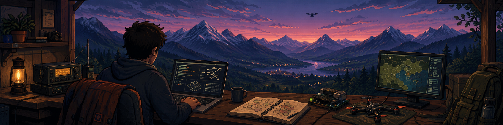

    <h1 align="center">Let's go</h1>
    

# Hello I am Paul.

I mainly work with **Go, Java, C/C++ and Python**, while continuously expanding my knowledge in distributed systems, networking, embedded computing and modern web technologies.

# Interests
My current areas of interest include:
1. Backend architecture and API
2. Distributed systems and WebSockets
3. Embedded systems and Raspberry PI

# Philosophy 

*I enjoy taking systems apart, understanding their architecture, and rebuilding them from the fundamentals. Whether it is software, networking, embedded systems, or hardware, I value curiosity, simplicity, and technical depth. I aim to understand enough to build, improve, and solve problems independently.*

> 1. Build things instead of following tutorials
> 2. Hope it works 

    <h1 align="center">Skills</h1>
    

## Learned at school :

## Learned by myself :

## Want to learn  :

